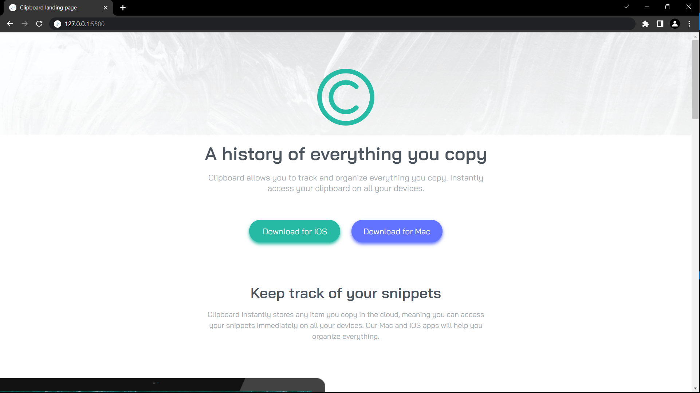

# Frontend Mentor - Clipboard landing page

This is a solution to the [Clipboard landing page challenge on Frontend Mentor](https://www.frontendmentor.io/challenges/clipboard-landing-page-5cc9bccd6c4c91111378ecb9). 

## Table of contents

- [Overview](#overview)
  - [Screenshot](#screenshot)
  - [Links](#links)
- [My process](#my-process)
  - [Built with](#built-with)
  - [What I learned](#what-i-learned)
- [Author](#author)

## Overview

### The challenge

Users should be able to:

- See hover states for interactive elements

### Screenshot

### Links

- Solution URL:  [Link](https://github.com/TJ-Shubham/clipboard-landing-page)
- Live Site URL: [Link](https://tj-shubham.github.io/clipboard-landing-page/)

## My process

### Built with

- Semantic HTML5 markup
- CSS custom properties
- Flexbox
- Grid
- Used media query
- Tailwind CSS

### What I learned

Understand the Greed & it's  properties.

## Author

- Website - [Shubham](https://github.com/TJ-Shubham)
